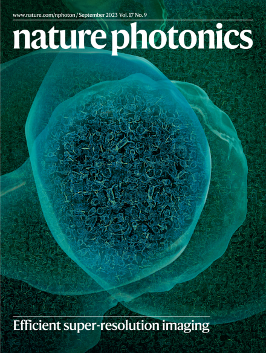
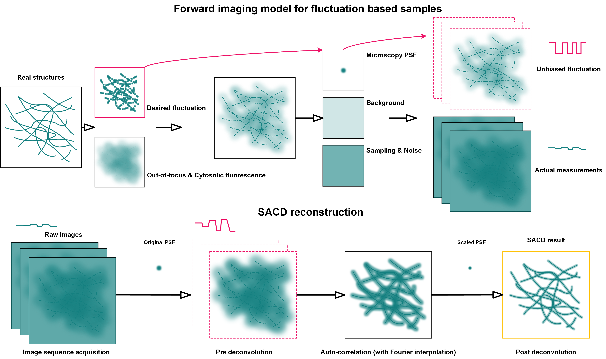

[](https://github.com/WeisongZhao/SACDj/)
[](https://github.com/WeisongZhao/SACDj/releases/tag/v1.1.3/)
[](https://github.com/WeisongZhao/SACDj/blob/master/LICENSE.txt)
[](https://github.com/WeisongZhao/SACDj/releases/tag/v1.1.3/)<br>
[](https://doi.org/10.1038/s41566-023-01234-9)
[](https://engineeringcommunity.nature.com/posts/super-resolution-made-easier)<br>
[](https://twitter.com/weisong_zhao/status/1370308101690118146)
[](https://github.com/WeisongZhao/SACDj/) 
[](https://github.com/WeisongZhao/SACDj/) 
[](https://github.com/WeisongZhao/SACDj/)


<p>
<h1 align="center">SACD<font color="#b07219">j</font></h1>
<h5 align="center">Fater super-resolution fluctuation imaging: SACD reconstruction with FIJI/ImageJ.</h5>
<h6 align="right">v1.1.3</h6>
</p>
<br>

<p>

<p>


This repository is for Simplified SACD (w/o Sparse deconvolution) and will be in continued development. It is a part of publication. For details, please refer to: [Weisong Zhao et al. Enhanced detection of fluorescence fluctuation for high-throughput super-resolution imaging, Nature Photonics (2023)](https://doi.org/10.1038/s41566-023-01234-9). Please cite SACD in your publications, if it helps your research.
<br>
<br>
<br>

<p>

</p>
<br>

[Portal](https://github.com/WeisongZhao/SACDj/raw/main/SACDj_-1.1.3.jar) to the plugin.

The related MATLAB version can be found at [HERE](https://github.com/WeisongZhao/SACDm/)

You can also find some fancy results and comparisons on my [website](https://weisongzhao.github.io/MyWeb2/portfolio-4-col.html).

If you are interested in our work, I wrote a [#behind_the_paper](https://engineeringcommunity.nature.com/posts/super-resolution-made-easier) post for further reading.


## SACD reconstruction

<p align='center'>

</p>

## SACD demo
<p align='center'>

</p>

These two demos can be found at the [release v1.1.3](https://github.com/WeisongZhao/SACDj/releases/tag/v1.1.3).

## Instruction

- Tips: Regarding the SACD SR frame visualization, it can be scaled with a gamma correction according to the bSOFI setting.
```python
In FIJI/ImageJ: 
	Process->Math->gamma(0.5)
	Process->Filters->Gaussian Blur(1)
	Process->Enhance Contrast(0%; normalize)
Macro:
run("Gamma...", "value=0.50");
run("Gaussian Blur...", "sigma=1");
run("Enhance Contrast...", "saturated=0 normalize");
```

- Tips: If data contains strong background, a pre background subtraction will help.
```python
In FIJI/ImageJ: 
	Process->Subtract background
```

## Declaration
This repository contains the java source code (Maven) for <b>SACD</b> imagej plugin.  This plugin is for the <b>Simplified SACD</b> (w/o Sparse deconvolution), and is also accompanied with conventional <b>SOFI reconstruction</b> ; <b>RL deconvolution</b>; and <b>PSF calculation</b> features. The development of this imagej plugin is work in progress, so expect rough edges. 

If you want to reproduce the results of SACD publication, the [SACDm](https://github.com/WeisongZhao/SACDm) (Matlab version) is recommended. Due to the distance between the Fourier interpolation, deconvolution of <b>SACDj</b>, and <b>SACDm</b>, there may exist a gap between the results of <b>SACDm</b> and <b>SACDj</b>. For me, the implementations of <b>SACDm</b> are more flexible and accurate.


## Version
- v1.1.3 Fixed for memory recycle & 20 times execution acceleration  
- v1.1.0 Useful tools separated: RL deconvolution, PSF calculation, SOFI reconstruction & Fourier interpolation  
- v1.0.0 Simplified SACD
- v0.6.0 Accelerated RL-TV deconvolution
- v0.5.0 Accelerated RL deconvolution
- v0.4.0 Born-Wolf PSF
- v0.3.0 SACD core
- v0.2.0 Fourier interpolation
- v0.1.0 Cumulant reconstruction core

## Related links: 
- MATLAB version of SACD: [SACDm](https://github.com/WeisongZhao/SACDm)
- **Some fancy results and comparisons:** [my website](https://weisongzhao.github.io/MyWeb2/portfolio-4-col.html)
- **Preprint:** [Weisong Zhao et al. Enhancing detectable fluorescence fluctuation for high-throughput and four-dimensional live-cell super-resolution imaging, bioRxiv (2022).](https://doi.org/10.1101/2022.12.12.520072)
- **Reference:** [Weisong Zhao et al. Enhanced detection of fluorescence fluctuation for high-throughput super-resolution imaging, Nature Photonics (2023)](https://doi.org/10.1038/s41566-023-01234-9)

<details>
<summary><b>Plans</b></summary>

- Improve the perfomance of Fourier interpolation;
- Remove redundant code and reconsitution ugly code. (in progress)
- ~~Accelarated RL deconvolution.~~
- ~~Accelarated RL-TV deconvolution.~~
- Add sparse deconvolution.
- Automation
</details>

## Open source [SACDj](https://github.com/WeisongZhao/SACDj)
This software and corresponding methods can only be used for **non-commercial** use, and they are under Open Data Commons Open Database License v1.0.